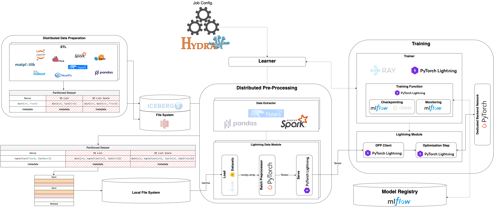

Overview
========

What is this project for?
-------------------------

Yggdrasil is a template for building deep learning projects.
It provides a structure for organizing code, data, and documentation,
making developing and maintaining machine learning models easier.
This specific repository was developed for my purposes, bringing my
implementations of the models and architectures. The structure of the
code makes these models reproducible and easy to use. It is designed
to be flexible and extensible, allowing users to add new features and
functionality easily.

Architecture
------------

The architecture of the yggdrasil is inspired by the `Meta's architecture
for the Recommendation System <https://arxiv.org/pdf/2108.09373>`_. The pipeline
is designed to be modular and extensible, allowing users to easily add new
features and functionality.

The architecture consists of several components, each responsible for a
specific part of the pipeline, which are the logical parts of the entire
ML lifecycle. The components are:

.. dropdown:: Distributed Data Preparation
   :icon: quote
   :chevron: down-up
   :animate: fade-in-slide-down

   In general, this component is responsible for preparing the data for
   training. It's usually called ETL (Extract, Transform, Load). The data
   is extracted from a source, transformed into the desired format, and
   loaded into the target filesystem.

   .. note::

      This component depends only on the user. The tools, process, code
      style, and other aspects of the data preparation are up to the
      user. The only requirementnt is that the data be stored in a
      specific format.

   .. tab-set::

      .. tab-item:: PySpark (recommended)

         .. code-block:: python

            import pyspark.sql.types as T
            import pyspark.sql.functions import F

            from pyspark.sql import SparkSession
            from sklearn.datasets import fetch_openml

            # Initialize Spark session
            spark = SparkSession.builder                          \
               .config("spark.sql.warehouse.dir", "wharehouse")   \
               .appName("MNIST_ETL")                              \
               .getOrCreate()

            # Extract raw data
            pdf = fetch_openml('mnist_784', version=1, as_frame=True).frame
            df = spark.createDataFrame(pdf)

            # Here ypu can apply any type of transformation you want ...

            # Mandatory transformation for the further data pre-processing
            feature_cols = [str(i) for i in range(784)]
            df = df.withColumn("id", F.monotonically_increasing_id()).withColumn(
               "sparse_vector",
               F.create_map(
                  *list(
                        sum(
                           [
                              (F.lit(fid).cast("int"), F.col(f"`{fname}`").cast("double"))
                              for fid, fname in enumerate(feature_cols)
                           ],
                           (),
                        )
                  )
               )
            ).drop(*feature_cols).withColumnRenamed("sparse_vector", "features")

            # Store the data in a dedicated warehouse
            spark.sql("DROP TABLE IF EXISTS mnist_784")
            df.select(
               F.col("id").cast(T.LongType()).alias("id"),
               F.col("features").cast(T.MapType(T.IntegerType(), T.FloatType())).alias("features"),
               F.col("class").cast(T.ShortType()).alias("label"),
            ).write.mode("overwrite").format("parquet").saveAsTable("mnist_784")

      .. tab-item:: Pandas

         .. code-block:: python

            import pandas as pd
            from sklearn.datasets import fetch_openml

            # Extract raw data
            df = fetch_openml("mnist_784", version=1, as_frame=True).frame

            # Here ypu can apply any type of transformation you want ...

            # Mandatory transformation for the further data pre-processing
            feature_cols = [str(i) for i in range(784)]
            df[feature_cols] = df[feature_cols].astype(float)
            df = df.assgin(
               id=df.index,
               features=df[feature_cols].apply(lambda row: dict(enumerate(row)), axis=1)
            )
            df = df.drop(columns=feature_cols)
            df = df[["id", "class", "features"]].rename(columns={"class": "label"})

            # Store the data in a dedicated warehouse
            df.to_parquet("wharehouse/mnist_784.parquet", index=False)

      .. tab-item:: Polars

         .. code-block:: python

            import polars as pl
            from sklearn.datasets import fetch_openml

            # Extract raw data
            pdf = fetch_openml("mnist_784", version=1, as_frame=True).frame
            df = pl.from_pandas(pdf)

            # Here ypu can apply any type of transformation you want ...

            # Mandatory transformation for the further data pre-processing
            feature_cols = [str(i) for i in range(784)]
            df = df.with_columns([pl.col(col).cast(pl.Float64) for col in feature_cols])
            df = df.with_columns([
               features=pl.struct(feature_cols).map_elements(
                  lambda x: {i: x[str(i)] for i in range(NUM_FEATURES)}
               )
            ])
            df = df.with_row_index(name="id", offset=0)
            df = df.select(["id", "class", "features"]).rename({"class": "label"})

            # Store the data in a dedicated warehouse
            df.write_parquet("wharehouse/mnist_784.parquet", index=False)

   :bdg-ref-primary-line:`To introduction tutorial <intro_tutorials/ddp>`

.. dropdown:: Distributed Pre-Processing
   :icon: quote
   :chevron: down-up
   :animate: fade-in-slide-down

   This component is responsible for pre-processing the data. It is unified
   and can be used for any type of data. The pre-processing is done in a
   distributed manner, allowing for faster processing and better scalability.

   The preprocessing is done in three steps. First, the data is extracted
   from the prepared table, which is acquired in the previous step. Then,
   the data is subsampled based on the sample range. Finally, the data is
   transformed into a dense format, which is required for the further processing.

   .. tab-set::
      :sync-group: dpp-examples

      .. tab-item:: PySpark (recommended)
         :sync: pyspark

         .. code-block:: python

            import pyspark.sql.functions as F
            import pyspark.sql.types as T
            from pyspark.sql import DataFrame

            from yggdrasil.core.dtypes.dataset import ParquetDataset
            from yggdrasil.core.dtypes.preprocessing.base import InputColumn
            from yggdrasil.data.data_extractor.base import DataExtractor
            from yggdrasil.data.etl import spark

            def select_relevant_columns(df: DataFrame) -> DataFrame:
               select_cols = [
                  F.col(InputColumn.SAMPLE_ID).cast(T.LongType()),
                  F.col(InputColumn.FEATURES).cast(T.ArrayType(T.FloatType())),
                  F.col(f"{InputColumn.FEATURES}_presence").cast(T.ArrayType(T.BooleanType())),
                  F.col(InputColumn.TARGET).cast(T.FloatType()),
               ]
               return df.select(*select_cols)

            class MNISTDataExtractor(DataExtractor):
               r"""
               MNIST supervised (default) data extractor.
               """

               def query_data(
                  self, table_identifier: str, sample_range: tuple[float, float]
               ) -> ParquetDataset:
                  session = spark.init.get_spark_session()
                  df = spark.extract.query_original_table(session, table_identifier)
                  df = spark.extract.hash_and_subsample(
                        df, sample_range=sample_range, hash_cols=["id"]
                  )
                  df = spark.transform.make_sparse2dense(
                        df,
                        "features",
                        possible_keys=spark.extract.get_distinct_keys(df, "features"),
                  )
                  df = select_relevant_columns(df)
                  dataset_url = spark.load.upload_as_parquet(session, df)
                  return ParquetDataset(dataset_url=dataset_url)

   Once the data is extracted and pre-processed, it is stored in a
   dedicated warehouse, which is a Parquet dataset. Then, this dataset
   is loaded in the batch manner to a datamodule. The same pre-processing
   steps should be applied to each batch of data. Batch preprocessor is
   responsible for this logic. It accepts a dictionary of tensors as input
   and returns a tensor data class as output. Inside the batch preprocessor,
   you can apply any transformations you want to the tensors. Also, it's
   highly recommended to use the preprocessor to normalize the data using
   different normalization techniques.

   .. tab-set::
      :sync-group: dpp-examples

      .. tab-item:: PySpark (recommended)
         :sync: pyspark

         .. code-block:: python

            import torch

            from yggdrasil.core.dtypes.base import ExtraData
            from yggdrasil.core.dtypes.classification.base import MulticlassPreprocessedInput
            from yggdrasil.core.dtypes.preprocessing.base import InputColumn
            from yggdrasil.preprocessing.batch_preprocessor import BatchPreprocessor
            from yggdrasil.preprocessing.normalization import sort_features_by_normalization
            from yggdrasil.preprocessing.preprocessor import Preprocessor

            class MNISTBatchPreprocessor(BatchPreprocessor):
               def __init__(self, features_preprocessor: Preprocessor) -> None:
                  super().__init__()
                  self.features_preprocessor = features_preprocessor

               def forward(self, batch: dict[str, torch.Tensor]) -> MulticlassPreprocessedInput:
                  batch_dict = {}
                  _, _, indcs = sort_features_by_normalization(
                        self.features_preprocessor.normalization_params
                  )
                  batch_dict["features"] = self.features_preprocessor(
                        torch.index_select(
                           batch[InputColumn.FEATURES],
                           dim=1,
                           index=torch.tensor(indcs),
                        ),
                        torch.index_select(
                           batch[f"{InputColumn.FEATURES}_presence"],
                           dim=1,
                           index=torch.tensor(indcs),
                        ),
                  )
                  batch_dict["extras"] = ExtraData(sample_id=batch[InputColumn.SAMPLE_ID].long())
                  batch_dict["target"] = batch[InputColumn.TARGET].unsqueeze(-1).float()
                  batch_dict["nclasses"] = 10  # MNIST has 10 classes (0-9)
                  return MulticlassPreprocessedInput.from_input(**batch_dict)

   The last component is a datamodule, which is responsible for
   orchestrating the data loading and pre-processing. It calls
   the data extractor to get the data, computes the metadata,
   loads the batches of the data applying the batch preprocessor,
   and passes the unified data (tensor data classes) to the model for training.

   .. tab-set::
      :sync-group: dpp-examples

      .. tab-item:: PySpark (recommended)
         :sync: pyspark

         .. code-block:: python

            from yggdrasil.core.dtypes.dataset import ParquetDataset, TableSpec
            from yggdrasil.core.dtypes.options import DatasetOptions, PreprocessingOptions
            from yggdrasil.core.dtypes.parameters import (
               NormalizationData,
               NormalizationKey,
            )
            from yggdrasil.core.dtypes.preprocessing.base import InputColumn
            from yggdrasil.data.data_extractor.mnist import DataExtractor
            from yggdrasil.data.datamodules.manual import ManualDataModule
            from yggdrasil.data.etl import spark
            from yggdrasil.preprocessing.preprocessor import Preprocessor

            class MNISTDataModule(ManualDataModule):
               def __init__(
                  self,
                  *,
                  input_table_spec: TableSpec | None = None,
                  data_extractor: DataExtractor | None = None,
                  setup_data: dict[str, str] | None = None,
                  saved_setup_data: dict[str, str] | None = None,
                  dataset_options: DatasetOptions | None = None,
                  features_preprocessing_options: PreprocessingOptions | None = None,
               ) -> None:
                  super().__init__(
                        input_table_spec=input_table_spec,
                        data_extractor=data_extractor,
                        setup_data=setup_data,
                        saved_setup_data=saved_setup_data,
                        dataset_options=dataset_options,
                  )

                  self.features_preprocessing_options = (
                        features_preprocessing_options or PreprocessingOptions()
                  )

               def run_feature_identification(
                  self, table_identifier: str
               ) -> dict[str, NormalizationData]:
                  session = spark.init.get_spark_session()
                  features_normalization_params = spark.transform.identify_normalization_params(
                        session=session,
                        table_name=table_identifier,
                        col_name=InputColumn.FEATURES,
                        preprocessing_options=self.features_preprocessing_options,
                        seed=42,  # Fixed seed for reproducibility
                  )
                  return {
                        NormalizationKey.FEATURES: NormalizationData(features_normalization_params)
                  }

               def query_data(
                  self,
                  table_identifier: str,
                  sample_range: tuple[float, float],
                  data_extractor: DataExtractor,
               ) -> ParquetDataset:
                  return data_extractor.query_data(table_identifier, sample_range)

               def build_batch_preprocessor(self) -> MNISTBatchPreprocessor:
                  if self.normalization_dict is None:
                        msg = "Normalization dict must be defined"
                        raise ValueError(msg)
                  features_normalization_data = self.normalization_dict[NormalizationKey.FEATURES]
                  features_norm_params = features_normalization_data.dense_normalization_params
                  features_preprocessor = Preprocessor(normalization_params=features_norm_params)
                  return MNISTBatchPreprocessor(features_preprocessor=features_preprocessor)

   :bdg-ref-primary-line:`To introduction tutorial <intro_tutorials/dpp>`

.. dropdown:: Training
   :icon: quote
   :chevron: down-up
   :animate: fade-in-slide-down

   This component is responsible for training the model.

.. toctree::
   :maxdepth: 2
   :hidden:

   intro_tutorials/index
