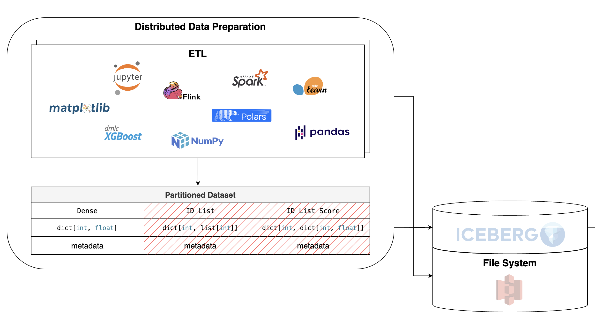

.. _ddp:

Distributed Data Preparation
============================

The first stage of every ML system is data preparation.
It varies and depends on the implementation of a data platform.
However, the industry dictates some standard rules and best practices.

.. dropdown:: Data Processing Pipeline Standards
   :icon: info
   :chevron: down-up
   :animate: fade-in-slide-down

   Today, the amount of data is enormous and continues to be generated
   at a rapid pace. So, data ingestion systems have become highly scalable
   and generic. Although the tools and implementation vary from company to
   company, the workflow remains the same. It looks like the following:

   1. A logging service writes logs to a Kafka consumer, which transforms
      them into CDC events.
   2. Those events are then passed through a streaming pipeline to apply
      a business logic to the given data. Typically, this pipeline is
      written using Apache Flink or Apache Spark Streaming.
   3. Then, the sinking pipeline refreshes the destination tables with
      enriched and properly **formatted** events (records). Typically, these
      tables are stored in a highly distributed manner through a designated
      warehouse, such as Delta or Iceberg.

   .. figure:: ../../_static/diagrams/architecture/data_streaming.png
            :alt: Data Streaming Concept
            :align: center
            :width: 100%

   .. tab-set::
      .. tab-item:: Netflix

         Netflix uses multiple Kafka monitors to track various data sources
         like logs, source databases, and others. Further, they produce CDC
         (Change Data Capture) events to a Kafka topic. The CDC events are
         then consumed by streaming data processors written in Flink to apply
         some business logic and produce a new topic. The new topic is then
         consumed by the standard sink processor, which puts the data in an
         affordable format for a data lake.

         .. figure:: ../../_static/imgs/netflix_data_pipeline.png
            :alt: Netflix Data Pipeline
            :align: center
            :width: 100%

         .. note::

            1. `Data Mesh — A Data Movement and Processing Platform @ Netflix <https://netflixtechblog.com/data-mesh-a-data-movement-and-processing-platform-netflix-1288bcab2873>`_
            2. `Keystone Real-time Stream Processing Platform <https://netflixtechblog.com/keystone-real-time-stream-processing-platform-a3ee651812a>`_
            3. `Delta: A Data Synchronization and Enrichment Platform <https://netflixtechblog.com/delta-a-data-synchronization-and-enrichment-platform-e82c36a79aee>`_

      .. tab-item:: Airbnb

         Airbnb uses a similar approach to Netflix. They use Kafka to
         monitor the data sources and produce CDC events. The events are
         then consumed by a notification service which triggers a specific
         document to be refreshed with pre-defined business logic and sinked
         to a data lake. On purpose to reconsile the data misses and bugs in
         the straming process they use a batch process.

         .. figure:: ../../_static/imgs/airbnb_data_pipeline.png
            :alt: Airbnb Data Pipeline
            :align: center
            :width: 100%

         .. note::

            1. `Riverbed: Optimizing Data Access at Airbnb's Scale <https://medium.com/airbnb-engineering/riverbed-optimizing-data-access-at-airbnbs-scale-c37ecf6456d9>`_
            2. `Riverbed Data Hydration — Part 1 <https://medium.com/airbnb-engineering/riverbed-data-hydration-part-1-e7011d62d946>`_

      .. tab-item:: Uber

         Uber tends to use an incremental update approach, which is literally CDC processing.
         Instead of streaming, the data is fed to the Marmaray framework, which processes it
         in mini-batch mode and serves as a streaming framework. Then, the data is linked to
         a destination database.

         .. figure:: ../../_static/imgs/uber_data_pipeline.png
            :alt: Uber Data Pipeline
            :align: center
            :width: 100%

         .. note::

            1. `Uber's Big Data Platform: 100+ Petabytes with Minute Latency <https://www.uber.com/en-TR/blog/uber-big-data-platform/>`_
            2. `Marmaray: An Open Source Generic Data Ingestion and Dispersal Framework and Library for Apache Hadoop <https://www.uber.com/en-TR/blog/marmaray-hadoop-ingestion-open-source/?uclick_id=02135f58-c2b3-4bf3-9c2e-015949ad0efd>`_

From the examples above, you can identify that the key component
is a data format. It evolves throughout the entire pipeline,
becoming more general and uniform in nature. The data flow is
fault-tolerant and easily scalable. Temporal snapshots of the data and
the scalability determine the fault tolerance.

.. note::

   Despite the intention to make the flow general as much as possible,
   some problems and datasets don't require such parallelism and concurrency,
   so other tools and libraries can be used to process the data.

The production data flow pipeline typically begins with logging user
activity and writing it to a data source. Then, the ETL pipeline processes
the raw data. Usually, this pipeline is differentiated into two types:
`streaming`_ and `batching`_. The processed data was then loaded into a
data warehouse (DWH) or a data lake, which usually pre-defines a data format.

The structure above was proposed by `Meta`_ and is widely used in the industry.

1. We process the raw data as we want, using any tools and libraries.
   There's no restriction on the way you process the data. It's recomended
   to use a distributed data processing framework, such as Apache Spark or
   Apache Flink, to process the large amounts of data. But in case of
   smaller datasets, you can use any other tools, such as Pandas or Polars.
2. Further, the data should be formatted in a specific way, s.t. the
   post-processing pipeline can work with it. We will discuss the data format
   in the next section :ref:`data fromatting`.

Raw Data Processing
~~~~~~~~~~~~~~~~~~~

.. warning::

   Currently, the library supports only Apache Spark as a data processing framework.
   You can still work with other libraries, such as Pandas or Polars, but you
   should store the result table via Spark API. In future releases, I will add
   support for other data processing frameworks.

Load raw data ...

.. tab-set::
   :sync-group: examples

   .. tab-item:: Synthetic example
      :sync: synthetic_example

      Import data manipulation libraries

      .. code-block:: python

         import numpy as np
         import pandas as pd

      Import Spark auxiliaries

      .. code-block:: python

         import pyspark.sql.types as T
         import pyspark.sql.functions as F

      Import Spark session initialization function

      .. code-block:: python

         from yggdrasil.data.etl.spark.init import get_spark_session

      Initialize Spark session with the default configuration

      .. code-block:: python

         spark = get_spark_session()

      Create a synthetic binary dataset with 10000 samples and 128 features

      .. code-block:: python

         NSAMPLES, NUM_FEATURES = 10000, 128
         input_matrix = np.random.rand(NSAMPLES, NUM_FEATURES)
         df = spark.createDataFrame(
            pd.DataFrame(
               {
                     **{
                        f"feature_{i}": input_matrix[:, i].tolist()
                        for i in range(NUM_FEATURES)
                     },
                     "target": np.random.randint(2, size=NSAMPLES).tolist(),
               }
            )
         )
         del input_matrix

   .. tab-item:: MNIST example
      :sync: mnist_example

      Import data manipulation libraries

      .. code-block:: python

         import pandas as pd
         from sklearn.datasets import fetch_openml

      Import Spark auxiliaries

      .. code-block:: python

         import pyspark.sql.types as T
         import pyspark.sql.functions as F

      Import Spark session initialization function

      .. code-block:: python

         from yggdrasil.data.etl.spark.init import get_spark_session

      Initialize Spark session with the default configuration

      .. code-block:: python

         spark = get_spark_session()

      Load the MNIST dataset from OpenML and convert it to a Spark DataFrame

      .. code-block:: python

         # Extract raw data
         pdf: pd.DataFrame = fetch_openml('mnist_784', version=1, as_frame=True).frame
         pdf = pdf.rename(columns={j: str(i) for i, j in enumerate(pdf.columns[:-1])})
         pdf["class"] = pd.to_numeric(pdf["class"])

         schema = T.StructType(
            [
               T.StructField(i, T.IntegerType(), True)
               for i in pdf.columns
            ]
         )

         # Coalesce to a single partition for easier handling wide datasets
         df = spark.createDataFrame(pdf, schema=schema).coalesce(1)

         del pdf

Transform data to the specified format :ref:`data fromatting` ...

.. tab-set::
   :sync-group: examples

   .. tab-item:: Synthetic example
      :sync: synthetic_example

      Add a unique identifier to each row in the DataFrame

      .. code-block:: python

         df = df.withColumn("uid", F.monotonically_increasing_id())

      Convert the DataFrame to a sparse vector format, where each feature
      is represented as a key-value pair in a map. The keys are the feature
      indices, and the values are the feature values. The resulting column
      is renamed to "features" and the original feature columns are dropped.

      .. code-block:: python

         select_cols = [f"feature_{i}" for i in range(NUM_FEATURES)]
         df = df.withColumn(
            "sparse_vector",
            F.create_map(
               *list(
                     sum(
                        [
                           (F.lit(fid).cast("int"), F.col(f"`{fname}`").cast("double"))
                           for fid, fname in enumerate(select_cols)
                        ],
                        (),
                     )
               )
            )
         ).drop(*select_cols).withColumnRenamed("sparse_vector", "features")

   .. tab-item:: MNIST example
      :sync: mnist_example

      Add a unique identifier to each row in the DataFrame

      .. code-block:: python

         df = df.withColumn("id", F.monotonically_increasing_id())

      Convert the DataFrame to a sparse vector format, where each feature
      is represented as a key-value pair in a map. The keys are the feature
      indices, and the values are the feature values. The resulting column
      is renamed to "features" and the original feature columns are dropped.

      .. code-block:: python

         feature_cols = [str(i) for i in range(784)]
         df = df.withColumn(
            "sparse_vector",
            F.create_map(
               *list(
                     sum(
                        [
                           (F.lit(fid).cast("int"), F.col(f"`{fname}`").cast("double"))
                           for fid, fname in enumerate(feature_cols)
                        ],
                        (),
                     )
               )
            )
         ).drop(*feature_cols).withColumnRenamed("sparse_vector", "features")

Store the result table in a dedicated file system ...

.. tab-set::
   :sync-group: examples

   .. tab-item:: Synthetic example
      :sync: synthetic_example

      .. code-block:: python

         spark.sql("DROP TABLE IF EXISTS demo_processed")
         df.select(
            F.col("uid").cast(T.LongType()).alias("uid"),
            F.col("features").cast(T.MapType(T.IntegerType(), T.FloatType())).alias("features"),
            F.col("target").cast(T.ShortType()).alias("target"),
         ).write.mode("overwrite").saveAsTable("demo_processed")

   .. tab-item:: MNIST example
      :sync: mnist_example

      .. code-block:: python

         spark.sql("DROP TABLE IF EXISTS mnist_784")
         df.select(
            F.col("id").cast(T.LongType()).alias("id"),
            F.col("features").cast(T.MapType(T.IntegerType(), T.FloatType())).alias("features"),
            F.col("class").cast(T.ShortType()).alias("target"),
         ).write.mode("overwrite").format("parquet").saveAsTable("mnist_784")

.. _Data Fromatting:

Data Formatting
~~~~~~~~~~~~~~~

The data is stored in the format that aligns with the
data processing framework used in the pipeline. Namely,
the features are splitted into three common groups:

1. **Dense** (``map<int, float>``): The features are stored in a dense vector
   format, where each feature is represented as a single value. This format
   is typically used for numerical features, such as floats or integers. E.g.,
   price of an item, age of a person, etc.

2. **ID List** (``map<int, list<int>>``): This is a way to represent
   categorical features, where each feature is represented as a list of IDs.
   This format is typically used for categorical features, such as user IDs,
   item IDs, etc. The IDs are stored as integers, and the list can contain
   multiple values. E.g., pages a user clicked, items a user bought, etc.

3. **ID List Score** (``map<int, map<int, float>>``): Some sparse features
   are stored in an additional column that further associates each categorical
   value with a floating point "score" used for weighing. E.g., page creation
   time.

.. warning::

   Currently, the library supports only ``map<int, float>`` format for dense features.

.. _streaming: https://nightlies.apache.org/flink/flink-docs-release-2.0/docs/learn-flink/overview/
.. _batching: https://spark.apache.org/docs/latest/quick-start.html#basics
.. _Meta: https://arxiv.org/pdf/2108.09373
