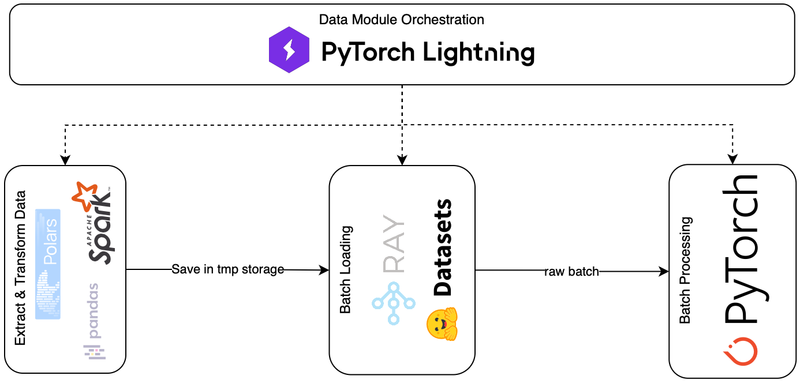

Distributed Pre-Processing
==========================

This stage is responsible for formalizing and generalizing
data for the training process. It consists of three consecutive steps:

1. Load the prepared data and apply additional transformations.
   Typically, these transformations are related to a specific model,
   rather than the data itself. Store the processed dataset in a temporary
   storage.

   .. note::
        As a separate process that occurs within data extraction,
        we compute statistics for the data normalization. This is
        the optional step that exhibits the bottleneck of distribution.
        The data should be on the same executor, so we are unable to
        process an infinite number of records. To avoid this, we manually
        limit the number of samples for statistical computation. The good
        news is that, according to the law of large numbers, the average
        should converge if we consider a large enough number of independent
        samples.

   .. warning::
        The question that arises - don't we have a data leak here? If we compute
        statistics based on randomly picked samples across an entire dataset, that
        could belong to a test or validation data subsample. Just keep this in mind.

2. Load a batch of a split and apply collation.

3. Process a collated batch, applying the tensor operations and extra
   tensor logic (e.g., mask creation, batch normalization, etc), preparing
   a batch for serving by evolving from the original tensors to a tensor
   dataclass instance. See :class:`~yggdrasil.core.dtypes.base.TensorDataClass`
   for more details.

In addition to these stages, we have a lightning data module
serving as an orchestrator.

Processing Stages
~~~~~~~~~~~~~~~~~

Extract & Transform & Load
--------------------------

Define the way how we extract and transform the data. For this purpose,
you should instantiate :class:`~yggdrasil.data.data_extractor.base.DataExtractor`.
It exhibits the only method ``query_data`` that you need to overwrite.

.. tab-set::
      :sync-group: dpp-examples

      .. tab-item:: Synthetic example
         :sync: synthetic_example

         .. code-block:: python

            import pyspark.sql.functions as F
            import pyspark.sql.types as T
            from pyspark.sql import DataFrame

            from yggdrasil.core.dtypes.dataset import ParquetDataset
            from yggdrasil.core.dtypes.preprocessing.base import InputColumn
            from yggdrasil.data.data_extractor.base import DataExtractor

            class MyDataExtractor(DataExtractor):

               def query_data(
                  self, table_identifier: str, sample_range: tuple[float, float]
               ) -> ParquetDataset:
                  # Extract data from the prepared table which is acquired in the previous step
                  session = spark.init.get_spark_session()
                  df = spark.extract.query_original_table(session, table_identifier)

                  # Subsample the data based on the sample range
                  df = spark.extract.hash_and_subsample(
                        df, sample_range=sample_range, hash_cols=["col1", "col2"]
                  )

                  # Here you can apply any type of transformation you want ...

                  # Unfold sparse columns to dense format
                  df = spark.transform.make_sparse2dense(
                        df,
                        "dense_mapping_col",
                        possible_keys=spark.extract.get_distinct_keys(df, "dense_mapping_col"),
                  )
                  df = df.select(
                     # InputColumn.SAMPLE_ID is a hash(col1, col2) from step above
                     F.col(InputColumn.SAMPLE_ID).cast(T.LongType()),

                     # Dense feature unfolding produces two columns:
                     # 1. dense_mapping_col - a dense representation of the sparse features
                     # 2. features_presence - a boolean array indicating the presence of each feature
                     F.col("dense_mapping_col").cast(T.ArrayType(T.FloatType())),
                     F.col("dense_mapping_col_presence").cast(T.ArrayType(T.BooleanType())),

                     # ... Add other relevant columns
                  )

                  # Store the processed data as a Parquet dataset in a temporary location
                  dataset_url = spark.load.upload_as_parquet(session, df)
                  return ParquetDataset(dataset_url=dataset_url)

      .. tab-item:: MNIST example
         :sync: mnist_example

         .. code-block:: python

            import pyspark.sql.functions as F
            import pyspark.sql.types as T
            from pyspark.sql import DataFrame

            from yggdrasil.core.dtypes.dataset import ParquetDataset
            from yggdrasil.core.dtypes.preprocessing.base import InputColumn
            from yggdrasil.data.data_extractor.base import DataExtractor
            from yggdrasil.data.etl import spark

            def select_relevant_columns(df: DataFrame) -> DataFrame:
               select_cols = [
                  F.col(InputColumn.SAMPLE_ID).cast(T.LongType()),
                  F.col(InputColumn.FEATURES).cast(T.ArrayType(T.FloatType())),
                  F.col(f"{InputColumn.FEATURES}_presence").cast(T.ArrayType(T.BooleanType())),
                  F.col(InputColumn.TARGET).cast(T.FloatType()),
               ]
               return df.select(*select_cols)

            class MNISTDataExtractor(DataExtractor):

               def query_data(
                  self, table_identifier: str, sample_range: tuple[float, float]
               ) -> ParquetDataset:
                  session = spark.init.get_spark_session()
                  df = spark.extract.query_original_table(session, table_identifier)
                  df = spark.extract.hash_and_subsample(
                        df, sample_range=sample_range, hash_cols=["id"]
                  )
                  df = spark.transform.make_sparse2dense(
                        df,
                        "features",
                        possible_keys=spark.extract.get_distinct_keys(df, "features"),
                  )
                  df = select_relevant_columns(df)
                  dataset_url = spark.load.upload_as_parquet(session, df)
                  return ParquetDataset(dataset_url=dataset_url)

All the data extractors implement some common logic, but I decided to keep it
more flexible and call this logic only on demand. The entire extraction process
would look like this:

1. Query the original table. :func:`~yggdrasil.data.etl.spark.extract.query_original_table`
2. Subsample the data based on the sample range. :func:`~yggdrasil.data.etl.spark.extract.hash_and_subsample`
3. Apply additional transformations.
4. Unfold sparse columns to dense format. :func:`~yggdrasil.data.etl.spark.transform.make_sparse2dense`
5. Store the processed data as a Parquet dataset in a temporary location. :func:`~yggdrasil.data.etl.spark.load.upload_as_parquet`

.. warning::
   As the DPP suggests, the process is distributed. However, I understand
   that not all problems require high parallelism, so I will also add the
   possibility to process the data using Pandas and Polars.

Batch Pre-Processor
-------------------

Another block that should be implemented is a batch preprocessor.
It applies some tensor transformations to a batch of data. You have to instantiate
:class:`~yggdrasil.preprocessing.batch_preprocessor.BatchPreprocessor` and
overwrite the :meth:`forward` method. It should return an instance of
:class:`~yggdrasil.core.dtypes.base.TensorDataClass`.

.. tab-set::
      :sync-group: dpp-examples

      .. tab-item:: Synthetic example
         :sync: synthetic_example

         .. code-block:: python

            import torch

            from yggdrasil.core.dtypes.base import ExtraData
            from yggdrasil.core.dtypes.classification.base import SomeCommonTensorDataClass
            from yggdrasil.core.dtypes.preprocessing.base import InputColumn
            from yggdrasil.preprocessing.batch_preprocessor import BatchPreprocessor
            from yggdrasil.preprocessing.normalization import sort_features_by_normalization
            from yggdrasil.preprocessing.preprocessor import Preprocessor

            class MyBatchPreprocessor(BatchPreprocessor):
               def __init__(self, dense_col_preprocessor: Preprocessor) -> None:
                  super().__init__()
                  # Specified preprocessor for dense column
                  self.dense_col_preprocessor = dense_col_preprocessor

               def forward(self, batch: dict[str, torch.Tensor]) -> SomeCommonTensorDataClass:
                  batch_dict = {}
                  # Preprocessor requires input tensors to be sorted by normalization
                  _, _, indcs = sort_features_by_normalization(
                        self.dense_col_preprocessor.normalization_params
                  )

                  # Apply preprocessor to the dense column
                  batch_dict["dense_mapping_col"] = self.dense_col_preprocessor(
                        torch.index_select(
                           batch["dense_mapping_col"],
                           dim=1,
                           index=torch.tensor(indcs),
                        ),
                        torch.index_select(
                           batch["dense_mapping_col_presence"],
                           dim=1,
                           index=torch.tensor(indcs),
                        ),
                  )

                  # Keep other relevant columns
                  batch_dict["extras"] = ExtraData(sample_id=batch[InputColumn.SAMPLE_ID].long())

                  # You can also apply other transformations to the batch ...

                  # Return the preprocessed batch as a tensor data class
                  # This class should be defined in your project, inheriting from
                  # yggdrasil.core.dtypes.base.TensorDataClass
                  return SomeCommonTensorDataClass.from_input(**batch_dict)

      .. tab-item:: MNIST example
         :sync: mnist_example

         .. code-block:: python

            import torch

            from yggdrasil.core.dtypes.base import ExtraData
            from yggdrasil.core.dtypes.classification.base import MulticlassPreprocessedInput
            from yggdrasil.core.dtypes.preprocessing.base import InputColumn
            from yggdrasil.preprocessing.batch_preprocessor import BatchPreprocessor
            from yggdrasil.preprocessing.normalization import sort_features_by_normalization
            from yggdrasil.preprocessing.preprocessor import Preprocessor

            class MNISTBatchPreprocessor(BatchPreprocessor):
               def __init__(self, features_preprocessor: Preprocessor) -> None:
                  super().__init__()
                  self.features_preprocessor = features_preprocessor

               def forward(self, batch: dict[str, torch.Tensor]) -> MulticlassPreprocessedInput:
                  batch_dict = {}
                  _, _, indcs = sort_features_by_normalization(
                        self.features_preprocessor.normalization_params
                  )
                  batch_dict["features"] = self.features_preprocessor(
                        torch.index_select(
                           batch[InputColumn.FEATURES],
                           dim=1,
                           index=torch.tensor(indcs),
                        ),
                        torch.index_select(
                           batch[f"{InputColumn.FEATURES}_presence"],
                           dim=1,
                           index=torch.tensor(indcs),
                        ),
                  )
                  batch_dict["extras"] = ExtraData(sample_id=batch[InputColumn.SAMPLE_ID].long())
                  batch_dict["target"] = batch[InputColumn.TARGET].unsqueeze(-1).float()
                  batch_dict["nclasses"] = 10  # MNIST has 10 classes (0-9)
                  return MulticlassPreprocessedInput.from_input(**batch_dict)

A preprocessor is a :class:`~torch.nn.Module` instance that is used inside :class:`~torch.utils.data.DataLoader`
as :func:`collate_fn` on top of the default collate. So, all the operations inside are tensor manipulations.
Additionally, the batch preprocessor standardizes data by transforming a set of tensors into a structured tensor data class.
You can implement whatever logic here, as long as it follows the pre-defined tensor dataclass structure. The batch preprocessor
is a process of transforming and enriching the dictionary of tensors, such that it "fulfills" the requested data structure.

.. note::
   In the example above, you may notice that we sort tensors by normalization parameters.

   .. code-block:: python

      _, _, indcs = sort_features_by_normalization(
            self.dense_col_preprocessor.normalization_params
      )

   This is not the temporary solution, until I'm not sure that this logic could be shared across
   different modules. The idea is to sort tensors by normalization parameters explicitly, so that
   the preprocessor can apply the normalization in a consistent manner. This is especially useful
   when dealing with large datasets where the order of features matters for the normalization process.

Orchestration
-------------

Lastly, there are all these blocks of communication and I/O logic. For these purposes,
the :class:`~lightning.pytorch.core.datamodule.LightningDataModule` itself provides an
excellent interface with a hooking mechanism. However, we can further automate the process
by defining an extraction and load interface. Previously, we described the data format (see :ref:`data fromatting`),
which is a loose restriction but a beneficial condition for automation. Furthermore, we have the snapshot mechanism,
which provides a temporal view of a dataset. Considering these two core definitions, we can automate the load and
transform process. This is exactly what :class:`~yggdrasil.data.datamodules.manual.ManualDataModule` does.

.. tab-set::
      :sync-group: dpp-examples

      .. tab-item:: Synthetic example
         :sync: synthetic_example

         .. code-block:: python

            from yggdrasil.core.dtypes.dataset import ParquetDataset, TableSpec
            from yggdrasil.core.dtypes.options import DatasetOptions, PreprocessingOptions
            from yggdrasil.core.dtypes.parameters import (
               NormalizationData,
               NormalizationKey,
            )
            from yggdrasil.data.data_extractor.mnist import DataExtractor
            from yggdrasil.data.datamodules.manual import ManualDataModule
            from yggdrasil.data.etl import spark
            from yggdrasil.preprocessing.preprocessor import Preprocessor

            class MyDataModule(ManualDataModule):
               def __init__(
                  self,
                  *,
                  input_table_spec: TableSpec | None = None,
                  data_extractor: DataExtractor | None = None,
                  setup_data: dict[str, str] | None = None,
                  saved_setup_data: dict[str, str] | None = None,
                  dataset_options: DatasetOptions | None = None,
                  dense_col_preprocessing_options: PreprocessingOptions | None = None,
               ) -> None:
                  # Initialize the data module with the necessary parameters
                  # A lot of intialization is done under the hood in the base (manual) datamodule
                  super().__init__(
                        input_table_spec=input_table_spec,
                        data_extractor=data_extractor,
                        setup_data=setup_data,
                        saved_setup_data=saved_setup_data,
                        dataset_options=dataset_options,
                  )

                  # Preprocessing options for the dense column
                  self.dense_col_preprocessing_options = (
                        dense_col_preprocessing_options or PreprocessingOptions()
                  )

               def run_feature_identification(
                  self, table_identifier: str
               ) -> dict[str, NormalizationData]:
                  # Identify normalization parameters for the dense column
                  session = spark.init.get_spark_session()
                  dense_col_normalization_params = spark.transform.identify_normalization_params(
                        session=session,
                        table_name=table_identifier,
                        col_name="dense_mapping_col,
                        preprocessing_options=self.dense_col_preprocessing_options,
                        seed=42,  # Fixed seed for reproducibility
                  )
                  return {
                        "dense_mapping_col": NormalizationData(dense_col_normalization_params)
                  }

               def query_data(
                  self,
                  table_identifier: str,
                  sample_range: tuple[float, float],
                  data_extractor: DataExtractor,
               ) -> ParquetDataset:
                  return data_extractor.query_data(table_identifier, sample_range)

               def build_batch_preprocessor(self) -> MyBatchPreprocessor:
                  # Build the batch preprocessor using the normalization parameters
                  if self.normalization_dict is None:
                        msg = "Normalization dict must be defined"
                        raise ValueError(msg)
                  dense_col_normalization_data = self.normalization_dict["dense_mapping_col"]
                  dense_col_norm_params = dense_col_normalization_data.dense_normalization_params
                  dense_col_preprocessor = Preprocessor(normalization_params=dense_col_norm_params)
                  return MyBatchPreprocessor(dense_col_preprocessor=dense_col_preprocessor)

      .. tab-item:: MNIST example
         :sync: mnist_example

         .. code-block:: python

            from yggdrasil.core.dtypes.dataset import ParquetDataset, TableSpec
            from yggdrasil.core.dtypes.options import DatasetOptions, PreprocessingOptions
            from yggdrasil.core.dtypes.parameters import (
               NormalizationData,
               NormalizationKey,
            )
            from yggdrasil.core.dtypes.preprocessing.base import InputColumn
            from yggdrasil.data.data_extractor.mnist import DataExtractor
            from yggdrasil.data.datamodules.manual import ManualDataModule
            from yggdrasil.data.etl import spark
            from yggdrasil.preprocessing.preprocessor import Preprocessor

            class MNISTDataModule(ManualDataModule):
               def __init__(
                  self,
                  *,
                  input_table_spec: TableSpec | None = None,
                  data_extractor: DataExtractor | None = None,
                  setup_data: dict[str, str] | None = None,
                  saved_setup_data: dict[str, str] | None = None,
                  dataset_options: DatasetOptions | None = None,
                  features_preprocessing_options: PreprocessingOptions | None = None,
               ) -> None:
                  super().__init__(
                        input_table_spec=input_table_spec,
                        data_extractor=data_extractor,
                        setup_data=setup_data,
                        saved_setup_data=saved_setup_data,
                        dataset_options=dataset_options,
                  )

                  self.features_preprocessing_options = (
                        features_preprocessing_options or PreprocessingOptions()
                  )

               def run_feature_identification(
                  self, table_identifier: str
               ) -> dict[str, NormalizationData]:
                  session = spark.init.get_spark_session()
                  features_normalization_params = spark.transform.identify_normalization_params(
                        session=session,
                        table_name=table_identifier,
                        col_name=InputColumn.FEATURES,
                        preprocessing_options=self.features_preprocessing_options,
                        seed=42,  # Fixed seed for reproducibility
                  )
                  return {
                        NormalizationKey.FEATURES: NormalizationData(features_normalization_params)
                  }

               def query_data(
                  self,
                  table_identifier: str,
                  sample_range: tuple[float, float],
                  data_extractor: DataExtractor,
               ) -> ParquetDataset:
                  return data_extractor.query_data(table_identifier, sample_range)

               def build_batch_preprocessor(self) -> MNISTBatchPreprocessor:
                  if self.normalization_dict is None:
                        msg = "Normalization dict must be defined"
                        raise ValueError(msg)
                  features_normalization_data = self.normalization_dict[NormalizationKey.FEATURES]
                  features_norm_params = features_normalization_data.dense_normalization_params
                  features_preprocessor = Preprocessor(normalization_params=features_norm_params)
                  return MNISTBatchPreprocessor(features_preprocessor=features_preprocessor)
